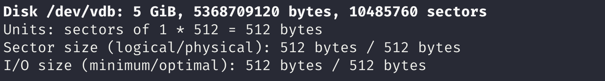
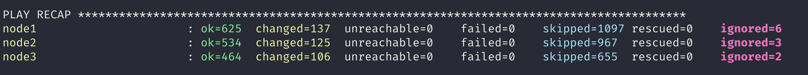
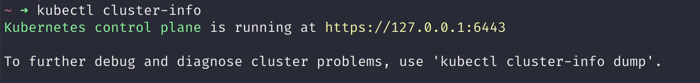
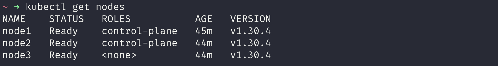

# Simplify Kubernetes Deployment: Local Cluster Setup with Lima VMs and Kubespray
Learn how to deploy a fully functional Kubernetes cluster locally using Lima VMs and Kubespray. This step-by-step guide walks you through setting up virtual machines, provisioning Kubernetes, configuring access with kubeconfig, and cleaning up resources. Perfect for developers and system administrators, this tutorial provides a cost-effective and flexible way to explore Kubernetes without relying on cloud resources.

## Introduction
This guide provides a step-by-step process to set up a local Kubernetes cluster using Lima virtual machines (VMs) and Kubespray. It is designed for developers and system administrators who want to test, learn, or experiment with Kubernetes in a local environment. By leveraging Lima VMs, you can simulate a multi-node Kubernetes cluster without requiring cloud resources, enabling a cost-effective and flexible setup.

This document covers the following:
- Creating and configuring Lima VMs.
- Provisioning Kubernetes clusters with Kubespray.
- Managing kubeconfig files for cluster access.
- Cleaning up VMs and Kubernetes resources when no longer needed.

Follow this guide to quickly set up a local Kubernetes cluster and start exploring its capabilities.

---

## Prerequisites
* [Lima](https://lima-vm.io/docs/installation/) should be installed and able to create VMs.

## Steps
* Create 3 local VMs and add disks.
* Provision VMs with Kubespray.
* Create `kubeconfig`.
* Cleanup.

---

### Creating VMs, Virtual Disks, and Attaching Disks

1. Create Lima VMs with [user-v2 network](https://lima-vm.io/docs/config/network/#lima-user-v2-network) so they can communicate. Recreate `default` if it is not in the `user-v2` network, ensuring `kubespray` can access other VMs.

    ```bash
    limactl delete default
    limactl create --vm-type=vz --rosetta --network=lima:user-v2 --name=default
    limactl create --vm-type=vz --rosetta --cpus=8 --memory=10 --network=lima:user-v2 --name=node-1
    limactl create --vm-type=vz --rosetta --cpus=8 --memory=10 --network=lima:user-v2 --name=node-2
    limactl create --vm-type=vz --rosetta --cpus=8 --memory=10 --network=lima:user-v2 --name=node-3
    ```

2. Create virtual disks with raw types (adjust size as needed):
    ```bash
    limactl disk create disk-1 --size 5G --format raw
    limactl disk create disk-2 --size 5G --format raw
    limactl disk create disk-3 --size 5G --format raw
    ```

3. Allow editing on default VMs:
    ```bash
    limactl edit default --mount-writable
    ```

4. Update the configuration for each VM to bind disks. Example for `node-1`, in `~/.lima/node-1/lima.yaml`:
    ```yaml
    additionalDisks:
    - name: "disk-1"
        format: false
    ```

5. Start the VMs and check disk binding:
    ```bash
    limactl start <vm-name>
    limactl shell node-1 sudo fdisk -l /dev/vdb
    ```
    

---

### Provisioning VMs with Kubespray

1. Clone the [Kubespray](https://github.com/kubernetes-sigs/kubespray/tree/release-2.26) repository:
    ```bash
    git clone --single-branch --branch release-2.26 https://github.com/kubernetes-sigs/kubespray.git kubespray-release-2.26
    ```

2. Create a new Ansible settings folder:
    ```bash
    cp -rfp inventory/sample inventory/lima
    ```

3. Build a Kubespray image:
    ```bash
    nerdctl.lima build . -t kubespray:dev
    ```

4. Run the image with inventory folder attached:
    ```bash
    nerdctl.lima run \
        -u root \
        -v ./inventory:/kubespray/inventory \
        -v ~/.ssh:/root/.ssh \
        --rm -it --name kubespray-dev \
        kubespray:dev /bin/bash
    ```

5. Inside the image:
    1. Install required dependencies:
        ```bash
        pip install -r contrib/inventory_builder/requirements.txt
        ```
    2. Create the config file (replace IPs with VM IPs):
        ```bash
        CONFIG_FILE=inventory/lima/hosts.yaml python3 contrib/inventory_builder/inventory.py 192.168.104.6 192.168.104.7 192.168.104.8
        ```
    3. Retrieve your SSH public key from `~/.ssh/id_rsa.pub` and add it to the `~/.ssh/authorized_keys` file on the VMs.
        - If you already have an SSH key pair on your local machine, the public key will be automatically added to the VMs' `authorized_keys`.
        - Copy the private key from your local machine to the Kubespray VMs and set its permissions to 600 using:
            ```bash
            chmod 600 ~/.ssh/id_rsa
            ```
    4. Provision the cluster:
        ```bash
        ansible-playbook -i inventory/lima/hosts.yaml -u lima --become --become-user=root -K cluster.yml
        ```
    5. After some time, the provisioning should be complete. For example:  
      
    If not, check the output and troubleshoot any issues.

---

### Create Kubeconfig File

1. Update permissions for the kubeconfig file on a controller node:
    ```bash
    ssh lima@localhost -p 60222
    sudo chown -R lima:lima /etc/kubernetes/admin.conf
    exit
    ```

2. Copy the kubeconfig file:
    ```bash
    scp -P 60222 lima@localhost:/etc/kubernetes/admin.conf ~/.kube/kubespray-lima.conf
    ```

3. Load the configuration for kubectl:
    ```bash
    export KUBECONFIG=~/.kube/kubespray-lima.conf
    ```

4. Verify the cluster setup:
    ```bash
    kubectl cluster-info
    ```
    > Output
    

    ```bash
    kubectl get nodes
    ```
    > Output
    

---

### Cleanup

1. Reset Kubernetes state (optional):
    ```bash
    ansible-playbook -i inventory/lima/hosts.yaml -u lima --become --become-user=root -K reset.yml
    ```

2. Delete VM instances:
    ```bash
    limactl delete node-1
    limactl delete node-2
    limactl delete node-3
    ```

---

## Conclusion
By following this guide, you can set up a local Kubernetes cluster using Lima VMs and Kubespray. This setup is ideal for development, testing, and learning Kubernetes without requiring cloud resources. It also provides flexibility for scaling and custom configurations. For further learning, explore the [Kubespray documentation](https://kubespray.io/) and Lima's [official guide](https://lima-vm.io/). Happy experimenting!

